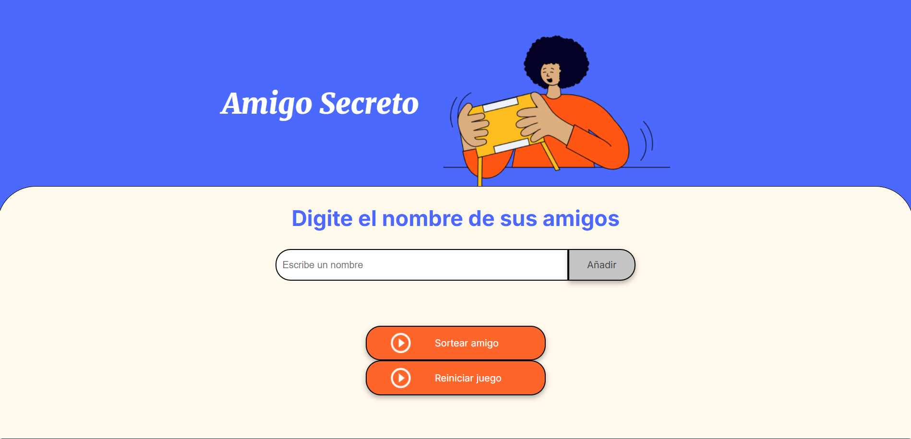
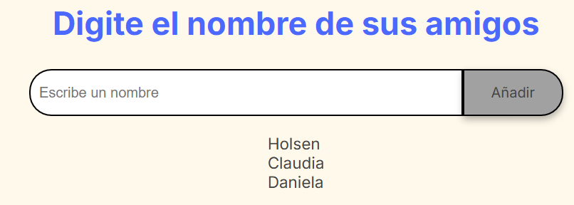
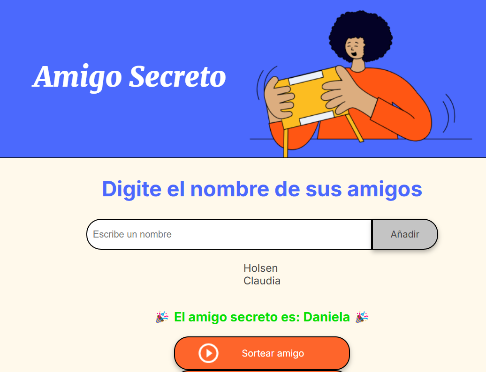
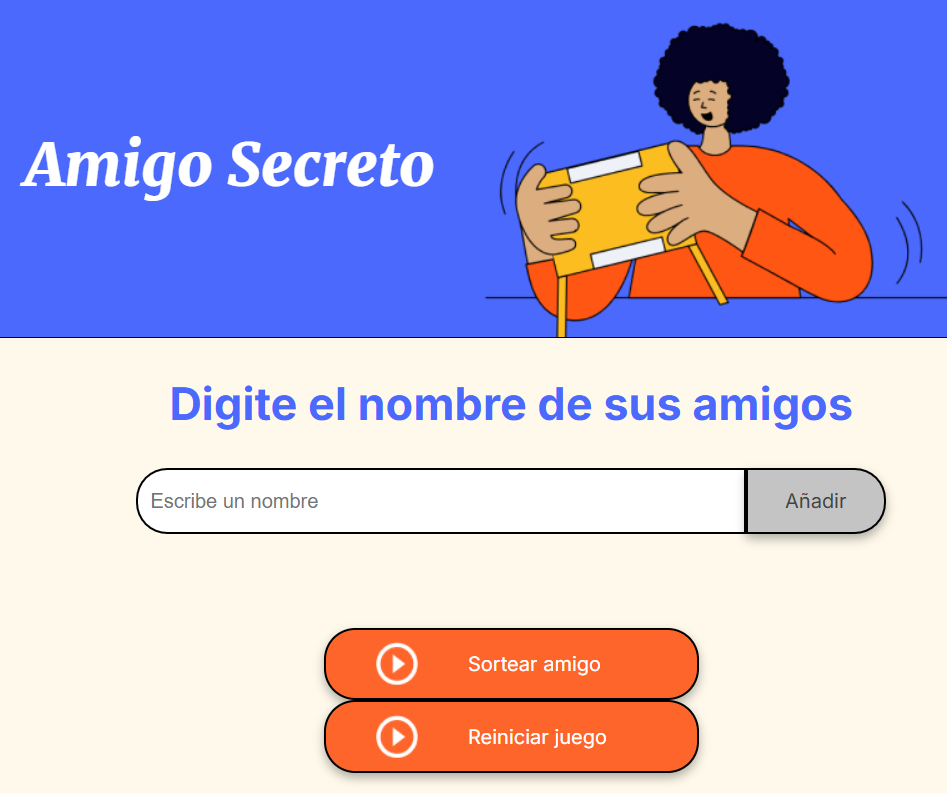

## challenge-amigo-secreto

### Descripción
Amigo Secreto es un juego en el que un grupo de participantes intercambia regalos de manera anónima, pero para ello, primero se debe realizar un sorteo de manera aleatoria entre todos los participantes. 

### Características
- Registrar participantes.
- Sorteo aleatorio de la lista de amigos.
- Visualizar el gandor del sorteo.
- Interfaz amigable.

### Tecnologías Utilizadas
- HTML
- CSS
- JavaScript
- Git y GitHub
- Visual Studio Code

### Uso
1. Descargar el archivo del Github o clonar el repositorio.
2. Ejecutar el programa y vizualizaras la siguiente pantalla.

  

4. Registrar a todos los participantes, ingresando el nombre y dando click en registrar

5. Ejecutar el sorteo de manera aleatoria y visualizar el nombre del ganador.

6. Reiniciar el juego para volver a jugar.

### Contacto 
Para cualquier consulta, escribir al siguiente correo: holsenzarate70@gmail.com

